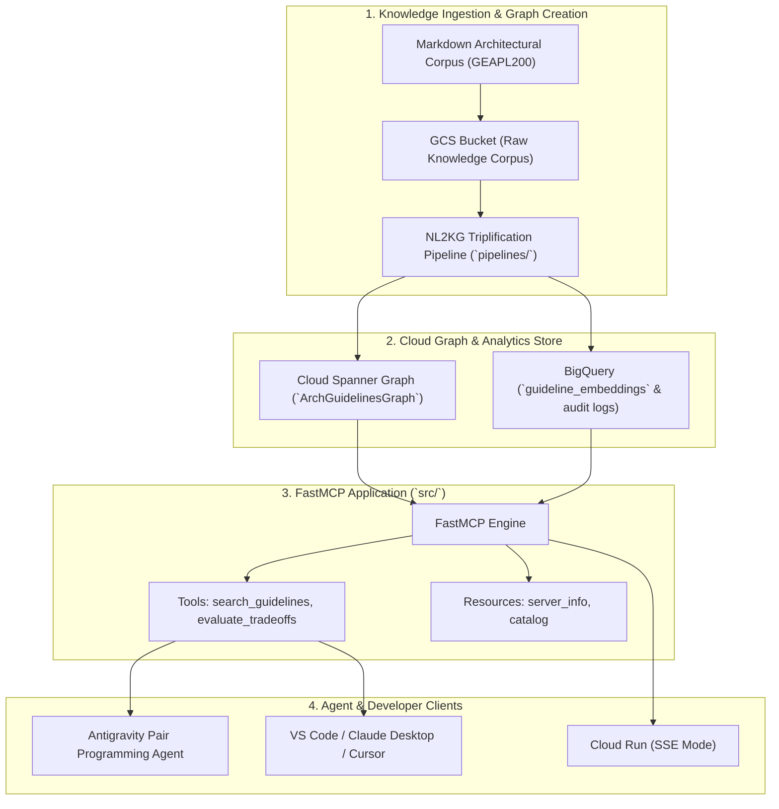

# Enterprise Agents Architectural Guidelines MCP Server

[](https://www.python.org/)
[](https://github.com/jlowin/fastmcp)
[]()

> A production-grade **Model Context Protocol (MCP)** server providing structured, graph-backed architectural guidelines, design patterns, and tradeoff analyses for building enterprise AI agents on Google Cloud.

---

## 🏛️ System Architecture



---

## 📂 Repository Layout

```markdown
├── .agents/                    # 🚀 Antigravity Internal Rules & Skills
│   ├── rules/                 # Always-active guidelines for THIS repo
│   │   ├── 01-architecture-guidelines.md
│   │   ├── 02-code-standards.md
│   │   └── 03-security-rules.md
│   └── skills/                # Reusable developer skills
│       ├── nl2kg-triplification/
│       ├── fastmcp-tool-dev/
│       └── eval-harness/
├── docs/                       # 📖 Specs & Validation Plans
│   ├── architecture.md
│   ├── specs/
│   │   ├── mcp-server-spec.md
│   │   ├── nl2kg-pipeline-spec.md
│   │   ├── repo-scaffolding.md
│   │   └── spanner-graph-schema.md
│   └── validation/
│       └── validation-plan.md
├── iac/                        # 🏗️ Infrastructure as Code (Terraform)
│   ├── main.tf
│   ├── variables.tf
│   ├── outputs.tf
│   ├── terraform.tfvars.example
│   └── modules/               # Reusable modules
│       ├── spanner/           # Spanner instance + Graph DDL
│       ├── bq/                # BigQuery datasets and tables
│       └── gcs/               # GCS storage bucket
├── pipelines/                  # 🧠 NL2KG Triplification Pipeline
│   ├── __init__.py
│   ├── config.py
│   ├── extract.py
│   ├── loader.py
│   ├── main.py
│   ├── schema.py
│   └── triplify.py
├── src/                        # 🔌 FastMCP Server Application
│   ├── __init__.py
│   ├── config.py
│   ├── server.py
│   ├── graph/                 # Graph clients & GQL queries
│   │   ├── client.py
│   │   └── queries.py
│   ├── models/                # Domain models & Pydantic schemas
│   │   └── guideline.py
│   └── tools/                 # FastMCP tool & resource definitions
│       ├── guidelines.py
│       ├── health.py
│       └── patterns.py
├── tests/                      # 📊 Evaluation Harness
│   ├── conftest.py
│   ├── test_pipeline.py
│   ├── test_server.py
│   └── evals/                 # Retrieval quality benchmarks
│       ├── golden_dataset.json
│       └── test_retrieval_quality.py
├── Dockerfile                  # Containerization
└── pyproject.toml              # Dependencies (UV)
```

---

## ⚡ Quickstart

### 1. Installation (UV)
```bash
# Clone the repository
git clone <repo-url>
cd gea-agents-arch-guidelines-mcp-server

# Install dependencies using uv
uv sync
```

### 2. Run FastMCP Server Locally (stdio mode)
For local IDE clients (e.g. Antigravity, Claude Desktop, Cursor):
```bash
uv run gea-mcp-server --transport stdio
```

### 3. Run FastMCP Server via SSE (HTTP mode)
For remote or Docker/Cloud Run hosting:
```bash
uv run gea-mcp-server --transport sse --port 8080 --host 0.0.0.0
```
Verify health:
```bash
curl http://localhost:8080/health
```

### 4. Run NL2KG Triplification Pipeline
```bash
# Extract entities & relationships from documentation
uv run nl2kg-pipeline extract --source-dir docs/specs

# Validate extracted triples
uv run nl2kg-pipeline validate --input-file build/graph/triples.json
```

### 5. Run Tests & Evaluation Benchmarks
```bash
# Run unit tests
uv run pytest tests/test_server.py tests/test_pipeline.py

# Run retrieval quality evaluation against golden benchmark
uv run pytest tests/evals/test_retrieval_quality.py -v
```

---

## 🛠️ Infrastructure as Code (Terraform)
Deploy the Cloud Spanner Graph, BigQuery dataset, and GCS bucket:
```bash
cd iac
cp terraform.tfvars.example terraform.tfvars
# Update terraform.tfvars with your GCP project ID
terraform init
terraform plan
terraform apply
```

---

## 🐳 Docker Containerization
```bash
# Build container image
docker build -t gea-mcp-server:latest .

# Run container locally
docker run -p 8080:8080 gea-mcp-server:latest
```
