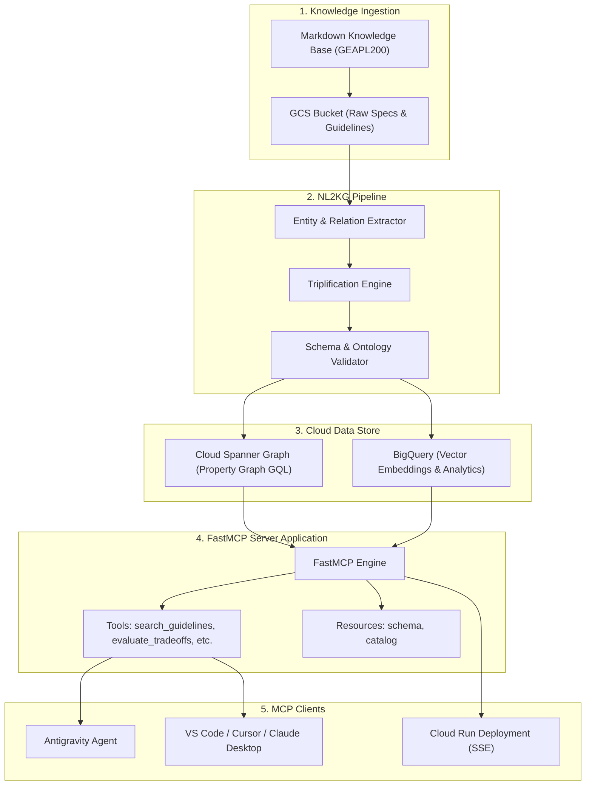

# Enterprise Agents Architectural Guidelines MCP Server — Architecture

## 1. Executive Summary
The Enterprise Agents Architectural Guidelines MCP Server (`gea-agents-arch-guidelines-mcp-server`) provides AI agents and enterprise developers with structured, verified knowledge on designing, securing, and deploying enterprise-grade agents on Google Cloud.

## 2. High-Level Architecture

## 3. Key Components
1. **NL2KG Triplification Pipeline (`pipelines/`)**:
   - Parses unstructured architectural text and produces typed graph triples (Nodes and Edges).
2. **Infrastructure as Code (`iac/`)**:
   - Terraform modules for Cloud Spanner with Graph DDL, BigQuery datasets, and GCS buckets.
3. **FastMCP Server (`src/`)**:
   - Asynchronous Python application exposing FastMCP tools with dual stdio / SSE transport.
4. **Evaluation Harness (`tests/`)**:
   - Golden dataset and pytest suites evaluating retrieval quality, latency, and schema correctness.
