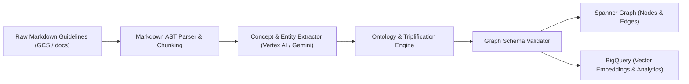

# NL2KG Pipeline Specification

## 1. Objective
The Natural Language to Knowledge Graph (NL2KG) Triplification Pipeline extracts entities, concepts, relationships, and architectural tradeoffs from unstructured markdown documents and converts them into structured graph triples for Cloud Spanner Graph and BigQuery.

## 2. Ingestion Flow

## 3. Graph Ontology Model
### Node Labels
- `Guideline`: Document or core recommendation unit (`id`, `title`, `category`, `summary`, `source_url`).
- `Pattern`: Concrete design or architectural pattern (`id`, `name`, `category`, `description`).
- `Tradeoff`: Evaluation metric or compromise dimension (`id`, `dimension`, `analysis`).
- `Component`: Architectural building block (`id`, `name`, `type`, `platform`).
- `Antipattern`: Common pitfall or anti-pattern (`id`, `name`, `hazard`, `remedy`).

### Edge Labels
- `RELATES_TO`: Connects Guidelines to related Guidelines or Concepts.
- `IMPLEMENTS`: Connects Patterns to Components or Guidelines.
- `MITIGATES`: Connects Patterns to Antipatterns.
- `REQUIRES`: Expresses structural dependencies between Patterns/Components.
- `TRADES_OFF`: Connects Patterns to Tradeoffs.
